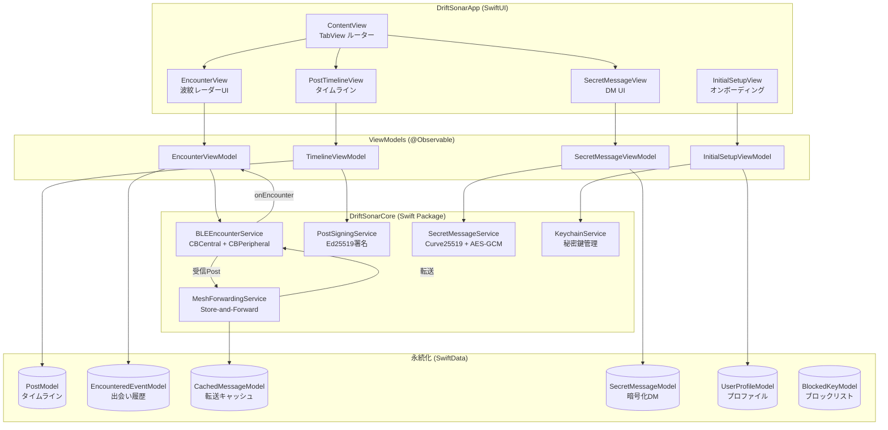
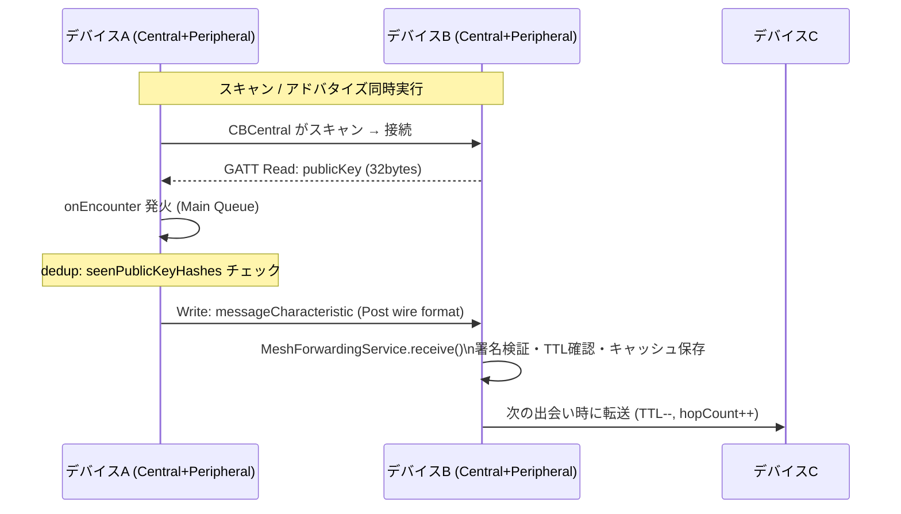
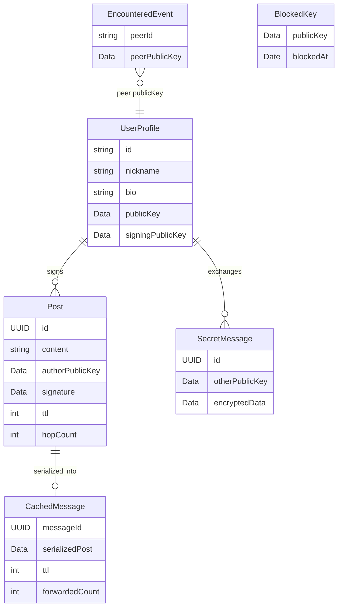
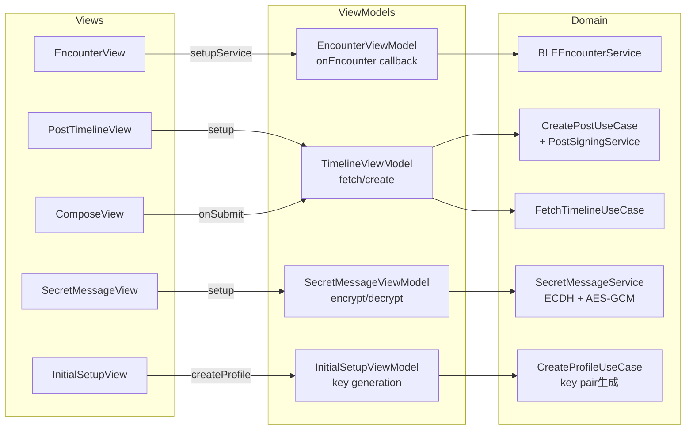
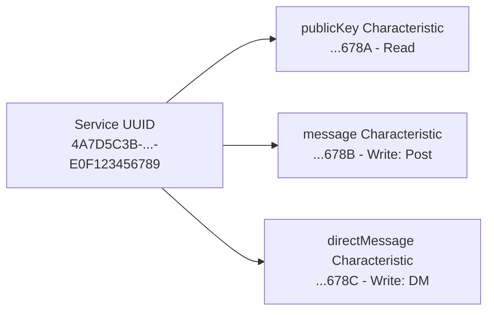

# DriftSonar アーキテクチャ図

## 全体構成



## BLE メッシュ通信フロー



## ドメインモデル関係



## View → ViewModel → Domain レイヤー



## 暗号化方式

```mermaid
flowchart TD
    subgraph PostSigning["Post 署名 (Ed25519)"]
        PS1[canonical bytes\nid+authorPublicKey+timestamp+content]
        PS2[Ed25519.sign(canonicalBytes, privateKey)]
        PS3[署名付きPost]
        PS1 --> PS2 --> PS3
    end

    subgraph E2E["Direct Message 暗号化 (Curve25519 + AES-GCM)"]
        E1[ECDH\nsenderPrivKey + receiverPubKey]
        E2[HKDF\nsalt: DriftSonar-SecretMessage-v1]
        E3[AES-256-GCM seal]
        E4[EncryptedMessage]
        E1 --> E2 --> E3 --> E4
    end

    subgraph Storage["秘密鍵保管 (Keychain)"]
        K1[signingPrivateKey\nkSecAttrAccessibleAfterFirstUnlockThisDeviceOnly]
        K2[agreementPrivateKey\n同上]
    end
```

## BLE UUID 定義


